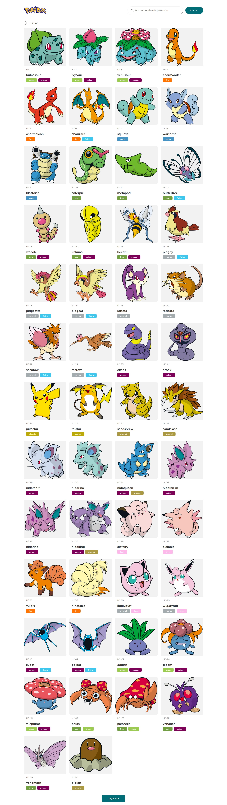
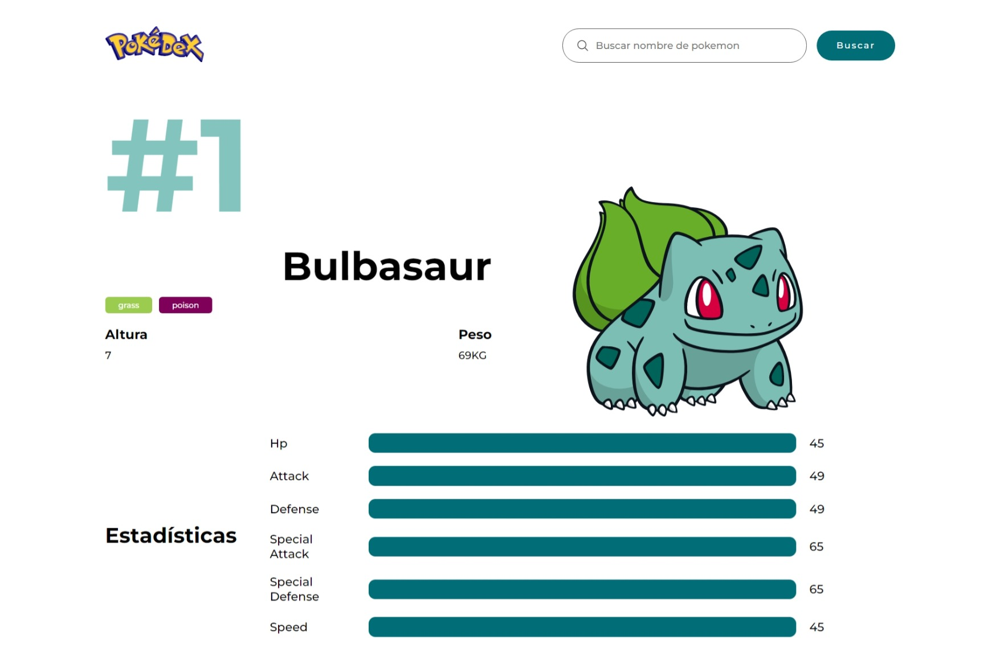
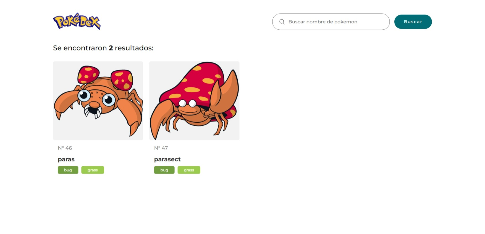
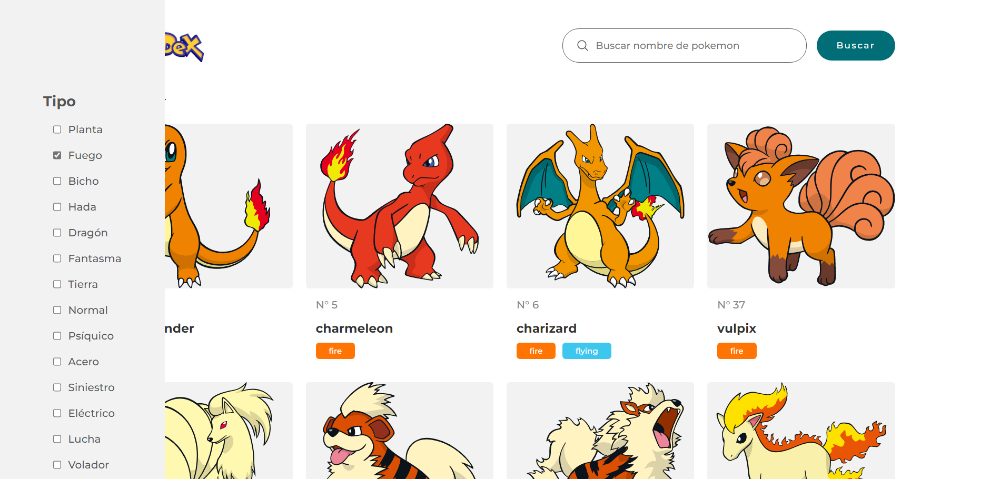

# PokeAPI 04
This design is inspired by this [video](https://youtu.be/BVQrG-Bp-94), which belongs to [Programación para el Mundo](https://www.youtube.com/@programacionparaelmundo).

## Technologies
This web page was made with the following technologies:
- HTML5
- CSS3
- JavaScript
- React
  - useState
  - useEffect
  - createContext
  - useContext
- React Router DOM
  - Link
  - Outlet
  - Navigate
  - useNavigate
  - useParams
  - useLocation
  - Route
  - Routes
  - BrowserRouter
- UI Ball
- PokeAPI

## Pages
This web page contains 2 sections: **Home**, **Details**, **Search** and **Filter**.

### Home
#### In this section you will see a list of 50 pokemon, and each pokemon is with its respective name, types and its ID. At the bottom of the list, there is a functional button that, if you click on it, will load the next 50 Pokemon.

### Details
#### In this section you will be able to see the details of the pokemon you chose in the previous section, by clicking on one of them. You can see more details of that pokemon like its weight, height, and its stats.

### Search
#### In this section you will see the pokemons that you have searched for in the search bar.

### Filter
#### In this section you can filter the pokemons according to their type or types that you prefer.

